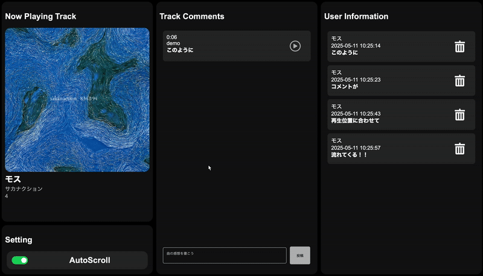

# SoundConnect
制作日:2024.7  
データベース課題作品

---

## はじめに
「データベースを用いた作品を制作する」という課題のもとで、私は音楽を通じた感動の共有をテーマに制作を行いました。制作のアイデアを探していたある日、音楽を聴きながら、「この歌詞、深いな」「この部分のサイドチェインの効き方が好きなんだよな」といった、自分なりの感想がふと頭に浮かびました。そして、「こういった感覚を、同じ曲を聴いている誰かと共有できたら面白いのでは」と思ったことが、この作品の出発点です。

授業ではAPIについても学んでいたため、日頃から利用しているSpotifyのAPIを活用することで現在聴いている曲の情報を自動で取得し、それに対してコメントを投稿・閲覧できるサービスを制作しました。
データベースを用いてコメント情報を保存し、楽曲ごとに感想を集積できる仕組みを設計することで、音楽の楽しみ方を「個人の感動」から「共有された体験」へと広げることを目指しました。

---

## 概要
SoundConnectはSpotifyユーザー向けのコミュニティサービスです。  
再生している曲を自動で取得し、コメントすることで他の同じ曲を再生しているユーザーと感動を共有することができます。  
コメントは再生位置に合わせて流れてくるので、その瞬間の感動をその瞬間で感じることができます。

---

## ⚙️機能
-  コメント機能
-  再生位置に合わせてコメントをオートスクロール
-  コメントの再生位置へシーク

▼参考映像  

---

## ⚠️注意事項
本作品は学校の課題作品のために制作されたものです。実際に公開することを想定していないため以下の理由で利用することができません。
-  SpotifyWebAPIを利用するにあたってのクライアントID、クライアントシークレットなどは悪用防止やセキュリティの観点から非公開となっています。
-  シーク（再生位置の変更）はSpotify Premium会員でないと利用できません。

---

## 最後に
この課題制作を通して、データベースを用いてコメント管理を行なったり、APIを用いて他サービスをより向上させるような作品を作れてよかったです。制作にあたって様々な壁（特にSpotify Web API)がありましたが、なんとか動かせる状態まで制作できてよかったです。
